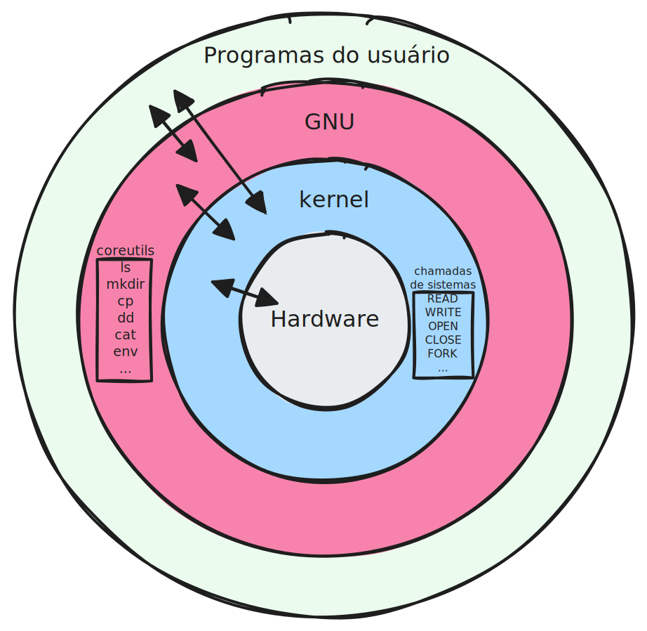
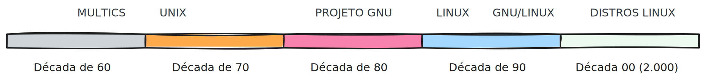

# Introdução a história do Linux

#### Sumário
- [Introdução](#1---introdução)
  - [Unix](#unix)
  - [Projeto GNU](#projeto-gnu)
  - [Kernel](#kernel)
  - [Minix](#minix)
  - [GNU/Linux](#projeto-gnu-e-linux-também-chamado-de-gnulinux)
  - [Nomenclatura](#nomenclatura-confusa)
  - [Distribuições Linux](#distribuições-gnulinux)
  - [Linha do Tempo Básica](#linha-do-tempo-básica)
- [Referências](#2---referências)

#### Objetivo

#### Requisitos

- Conhecimento básico sobre computadores

## 1 - Introdução

### Unix
O Sistema Operacional **Unix** foi desenvolvido pelos pesquisadores Ken Thompson e Dennis Ritchie da Bell Labs para o computador PDP-7 no final dos anos 60. A motivação do projeto **Unix** foi que o Sistema Operacional anterior, chamado **Multics**, era muito complexo, difícil de manter e não apropriado para os **minicomputadores** que estavam surgindo. Assim, Thompson e Ritchie optaram por reescrever um Sistema Operacional mais simples: o **Unix**, que estabeleceu princípios que influenciam os sistemas operacionais até hoje:

- **Faça uma coisa só, e faça bem feito**: cada programa tem uma responsabilidade clara
- **Tudo é arquivo**: dispositivos, processos e configurações são tratados como arquivos
- **Composição de programas simples**: programas pequenos podem ser combinados para realizar tarefas complexas
- **Multiusuário e Multitarefas**: vários usuários e vários processos concorrendo pelos recursos do computador

Porém, o **Unix** foi um sistema operacional proprietário, isto é, era necessário pagar para a Bell Labs para usá-lo. O modelo de licença teve alterações ao longo das décadas, chegando à custar \$ 20.000,00 para entidades não educacionais (universidades) no início dos anos 70 e aproximadamente \$ 2.500,00 na década de 90.

### Projeto GNU
Em 1983, Richard Stallman, frustado com a evolução comercial dos computadores, iniciou o **Projeto GNU** (*GNU's Not Unix*), com o objetivo de criar um sistema operacional. O projeto desenvolveu ferramentas essenciais como compilador GCC, editor de texto Emacs e utilitários de shell. Todo o **Projeto GNU** esta sobre a bandeira **livre**, isto é, **Software Livre**, onde o usuário do programa tem 04 (quatro) permissões essenciais:

- Executar o programa
- Estudar e alterar o código-fonte do programa
- Redistribuir cópias exatas do programa
- Distribuir versões modificadas do programa

Porém faltava um componente central: o **kernel** do sistema operacional. Inicialmente, o **kernel** em desenvolvimento, chamado **Hurd**, porém, este não estava maduro o suficiente para ser lançado como um Sistema Operacional completo.

*Reprodução: autor*

### Kernel
O **Kernel** é um programa que tem controle completo sobre tudo que ocorre no sistema computacional como um todo, incluindo no hardware e no software. Considerado como **núcleo** de um sistema operacional, o **kernel** é a camada intermediária entre os programas do usuário e o hardware.

*Reprodução: [Wikipedia - kernel](https://en.wikipedia.org/wiki/File:Kernel_Layout.svg)*

Sendo as principais responsabilidades:
- Gerenciar a **CPU** (escalonamento de processos)
- Gerenciar a **memória** (alocação, paginação)
- Controlar **dispositivos de hardware** (drivers)
- Gerenciar o **sistema de arquivos**
- Controlar a **comunicação entre processos**

> Uma observação importante: o usuário **nunca interage diretamente** com o kernel. A comunicação se dá por meio de **chamadas de sistema** (*syscalls*).

### Minix
**Andrew Stuart Tanenbaum**, professor em **Vrije Universiteit Amsterdam** de Organização de Computadores e Sistemas Operacionais, escreveu o livro *Operating Systems: Design and Implementation*, que continha o sistema operacional completo **Minix** (*Mini-Unix*) com propósito educacional, já que o Unix ainda não era acessível à todos. Apesar de ser um sistema operacional educacional, o **Minix** recebeu atenção de pesquisadores, professores e estudantes.

### Linux

> *Hello everybody out there using minix*
> 
> *I'm doing a (free) operating system (just a hobby, won't be big and professional like gnu) for 386(486) AT clones.*
> 
> \- *Linux Torvalds*

**Linux Torvalds**, com o intuito de conhecer e implementar soluções para os computadores que usava, principalmente o seu 386, percebeu que tinha escrito um **kernel**, que ganhou atenção a partir de 1992.

*Reprodução: [Wikipedia - Linux](https://pt.wikipedia.org/wiki/Tux#/media/Ficheiro:Tux.svg)*

### Projeto GNU e Linux, também chamado de GNU/Linux

O **Projeto GNU** adotou o **kernel Linux**, tornando-se oficialmente um Sistema Operacional Completo.

> Vale lembrar que o **Projeto GNU** e **Linux** coexistem, e é o principal Sistema Operacional livre, porém existem outros projetos, como o Android, que é o **Android Open Source Project** que utiliza o **Linux** e também o **Orbis OS** (PS4 e PS5), que usa as ferramentas do **freeBSD** (customizadas) e o **kernel BSD**.  

*Reprodução: autor*

### Nomenclatura confusa!

É muito comum confundir todas estas definições, então, de maneira resumida, têm-se:

- **Projeto GNU**: ferramentas essenciais para uso do computador
- **Linux**: é o kernel, núcleo do sistema operacional, sendo a camada intermediária de comunicação entre o software e o hardware
- **GNU/Linux**: é a união das ferramentas do Projeto GNU com o kernel Linux, formando um sistema operacional pronto para uso, porém, não tão simples para usuários inexperientes
- **Distribuição Linux**: é um Sistema Operacional GNU/Linux com recursos extras 

### Distribuições GNU/Linux

Existem diversos *sabores* de GNU/Linux. O que todas tem em comum é que adicionam recursos extras que facilitam a vida do usuário comum, tais como: Ambiente Gráfico (GUI), Gerenciador de Pacotex (programas), Diversas Configurações (controle de usuários, redes, etc), Aplicativos básicos (navegador, calculadora) e, principamente, instalador do tipo *wizard*.

Os *sabores* de GNU/Linux são classificadas em:
- **Distribuições *upstream***: também chamadas de *distros base*, pois são contruídas diretamente sobre o GNU/Linux, cada uma com uma filosofia específica. 
- **Distribuições *downstream***: também chamadas de *distros derivadas*, pois são *distribuições base* com alterações/modificações.

Algumas **Distribuições *upstream*** (base) e ***downstream*** (derivadas) são mostradas na Figura abaixo.

*Reprodução: autor*

### Linha do Tempo Básica

*Reprodução: autor*

| | | |
|:---:|:---:|:---:|
|[↑ voltar ao topo](#introdução-a-história-do-linux)|[⌂ página inicial](README.md)|[→ sobre terminal](terminal.md)|

## 2 - REFERÊNCIAS

BYFIELD, Bruce. An introduction to MINIX. Linux Journal, [S.l.], v. 2010, n. 194, p. 5, 1 ago. 2010. Disponível em: https://www.linuxjournal.com/article/10754. Acesso em: 21 de abril de 2026.

DISTROWATCH. Beginner's guide. [S.l.]: DistroWatch, [2001]. Disponível em: https://distrowatch.com/dwres.php?resource=beginners-intro. Acesso em 20 de abril de 2026.

FREE SOFTWARE FOUNDATION. Philosophy of the GNU Project. [S.l.]: Free Software Foundation, [1996]. Disponível em: https://www.gnu.org/philosophy/philosophy.html. Acesso em: 19 de abril de 2026.

FREE SOFTWARE FOUNDATION. GNU/Linux FAQ. [S.l.]: Free Software Foundation, [1997]. Disponível em: https://www.gnu.org/gnu/gnu-linux-faq.html#windows. Acesso em: 18 de abril de 2025.

HOLBROOK, Bernard D.; BROWN, W. Stanley. A history of computing research at Bell Laboratories (1937-1975). Murray Hill: Bell Telephone Laboratories, 1982. (Computing Science Technical Report, n. 99). Disponível em: https://archive.computerhistory.org/resources/access/text/2022/08/102804421-05-01-acc.pdf. Acesso em: 18 de abril de 2026.

LINUX INFORMATION PROJECT. Kernel definition. [S.l.]: LINFO, [2004]. Disponível em: https://www.linfo.org/kernel.html. Acesso em: 18 de abril de 2026.

LOUIS, Patrick. Licenses on Unix. Venam's Blog, 4 jun. 2017. Disponível em: https://venam.net/blog/unix/2017/06/04/licenses.html. Acesso em: 18 de abril de 2026.

